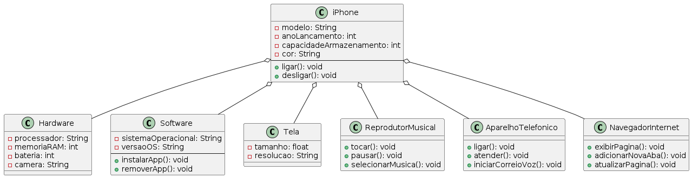

# Projeto iPhone

Este projeto contém um diagrama UML que modela as características do primeiro iPhone, incluindo funcionalidades como reprodutor musical, aparelho telefônico e navegador na internet.

## Diagrama UML

### Classes e Métodos

- **iPhone**
  - Atributos:
    - modelo: String
    - anoLancamento: int
    - capacidadeArmazenamento: int
    - cor: String
  - Métodos:
    - ligar(): void
    - desligar(): void

- **Hardware**
  - Atributos:
    - processador: String
    - memoriaRAM: int
    - bateria: int
    - camera: String

- **Software**
  - Atributos:
    - sistemaOperacional: String
    - versaoOS: String
  - Métodos:
    - instalarApp(): void
    - removerApp(): void

- **Tela**
  - Atributos:
    - tamanho: float
    - resolucao: String

- **ReprodutorMusical**
  - Métodos:
    - tocar(): void
    - pausar(): void
    - selecionarMusica(): void

- **AparelhoTelefonico**
  - Métodos:
    - ligar(): void
    - atender(): void
    - iniciarCorreioVoz(): void

- **NavegadorInternet**
  - Métodos:
    - exibirPagina(): void
    - adicionarNovaAba(): void
    - atualizarPagina(): void
